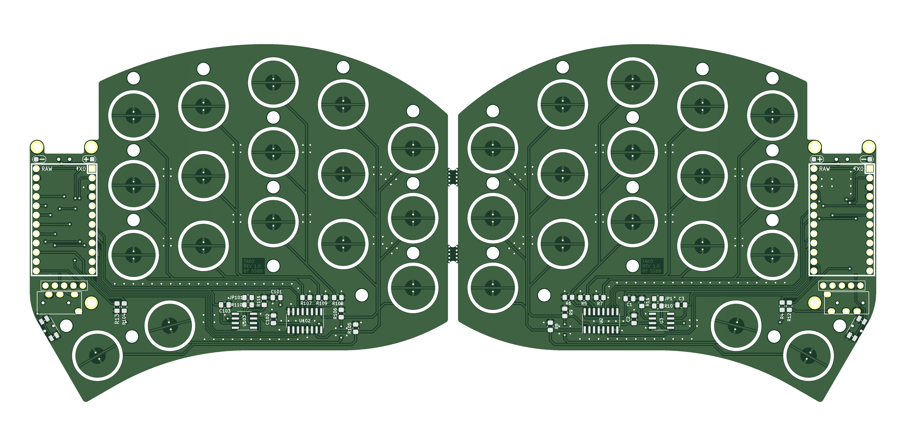

# Tako

  
  
  

Tako is a vertical stagger split keyboard with electrostatic capacitive (EC) non-contact switches.

## Bill Of Materials (BOM)

### Production Files

Depending on which parts you are going to use, make sure to select the proper top plate (OG or NIZ). Ensure you use the correct thickness - the **OG (OEM, Deskeys, etc) plate should be 1.2mm**, and the NIZ should be 1.6mm!

### MCU

RP2040-based boards should be used for wired build - Liatris, Frood, Sea-Picro, Splinky, [etc](https://github.com/qmk/qmk_firmware/blob/master/docs/platformdev_rp2040.md#rp2040-community-edition-idrp2040_ce).

**ATmega32U4 (Pro Micro) won't work.**

#### Wireless

For a wireless build, you can use [nice!nano](https://nicekeyboards.com/nice-nano/). Keep in mind that EC matrix consume significantly more power than mechanical keyboards. An 80mAh battery placed under the MCU will last for about a day only. I don't have exact numbers yet (still waiting for a power profiler), but you will likely need to use a larger battery. Consider using longer standoffs with a 3D-printed or acrylic spacer between the PCB and the bottom plate, and place the battery there.

### Display

5 pins for [nice!view](https://nicekeyboards.com/nice-view/) are exposed. 128x32 OLED can be used on first 4 pins but won't be perfectly centered.

### Components

| Component            | Package        | Amount | Details                                                                                                                                  |
|----------------------|----------------|--------|------------------------------------------------------------------------------------------------------------------------------------------|
| OPA350               | SOIC-8 / SOP-8 | 2      | [LCSC](https://www.lcsc.com/product-detail/_Texas-Instruments-_C13388.html)                                                              |
| 74HC4051             | SOIC-8 / SOP-8 | 2      | [LCSC](https://www.lcsc.com/product-detail/_Nexperia-_C9386.html)                                                                        |
| 100nF Capacitor      | 0805           | 4      | [LCSC](https://www.lcsc.com/product-detail/_FH-Guangdong-Fenghua-Advanced-Tech-_C38141.html)                                             |
| 220pF Capacitor      | 0805           | 2      | [LCSC](https://www.lcsc.com/product-detail/_Chinocera-_C465163.html)                                                                     |
| 100&#8486; Resistor  | 0805           | 8      | [LCSC](https://www.lcsc.com/product-detail/_UNI-ROYAL-Uniroyal-Elec-_C17408.html)                                                        |
| 1k&#8486; Resistor   | 0805           | 2      | [LCSC](https://www.lcsc.com/product-detail/_UNI-ROYAL-Uniroyal-Elec-_C17513.html)                                                        |
| 100k&#8486; Resistor | 0805           | 12     | [LCSC](https://www.lcsc.com/product-detail/_UNI-ROYAL-Uniroyal-Elec-_C149504.html)                                                       |
| Reset Switch         |                | 2      | [LCSC](https://www.lcsc.com/product-detail/Tactile-Switches_PANASONIC-EVQPUC02K_C79174.html)                                             |
| PJ-320A              |                | 2      | *Wired only*. [LCSC](https://www.lcsc.com/product-detail/_XKB-Connectivity-_C2884926.html)                                               |
| 5.1k&#8486; Resitor  | 0805           | 2      | *Wired only*. [LCSC](https://www.lcsc.com/product-detail/Chip-Resistor-Surface-Mount_UNI-ROYAL-Uniroyal-Elec-0805W8F5101T5E_C27834.html) |
| Power Switch         |                | 2      | *Wireless only*. [LCSC](https://www.lcsc.com/product-detail/Slide-Switches_C-K-PCM12SMTR_C221841.html)                                   |

### Mounting

#### OG Plate

| Part            | Amount | Details                                                                               |
|-----------------|--------|---------------------------------------------------------------------------------------|
| M2x6 Standoff   | 16     | [Aliexpress](https://aliexpress.com/item/33020779625.html?sku_id=12000029334740103)   |
| M2x4 Screws     | 32     | [Aliexpress](https://aliexpress.com/item/4001248931159.html?sku_id=12000034160900192) |
| M1.6x6 Standoff | 12     | [Aliexpress](https://aliexpress.com/item/33020779625.html?sku_id=12000029334740086)   |
| M1.6x4 screws   | 24     | [Aliexpress](https://aliexpress.com/item/4001248931159.html?sku_id=12000019001985950) |

#### NIZ Plate

| Part            | Amount | Details                                                                               |
|-----------------|--------|---------------------------------------------------------------------------------------|
| M2x6 Standoff   | 28     | [Aliexpress](https://aliexpress.com/item/33020779625.html?sku_id=12000029334740103)   |
| M2x4 Screws     | 56     | [Aliexpress](https://aliexpress.com/item/4001248931159.html?sku_id=12000034160900192) |

### EC Parts

| Part            | Amount |
|-----------------|--------|
| Housings        | 34     |
| Domes           | 34     |
| Conical springs | 34     |
| Sliders         | 34     |
| Silencing rings | 34     |

- If you going to use DES V3/Carrot domes then it's recommended to get DES Volcano springs to avoid sping crunch.
- Silencing rings are recommended for DES parts. If you want the same key travel as HHKB Type-S with DES housings and DES sliders then you should get #7 rings.

Some EC vendors:

- [deskeys](https://deskeys.io/)
- [Unreal Keyboard](https://unrealkeyboards.com/)
- [NIZ Store](https://www.nizkeyboard.com/products/2019-new-niz-ec-switch)
- [Beekeeb (NIZ)](https://shop.beekeeb.com/product/niz-ec-switch/)
- YMDK [Housings](https://aliexpress.com/item/1005005724051113.html), [Sliders](https://aliexpress.com/item/1005005721976294.html) and [Domes](https://aliexpress.com/item/1005005721050116.html)

**You can only use MX-compatible sliders due to the housing orientation.** [See details](./docs/housing_orientation.md).

NIZ sliders are MX-compatible by default.

## Build Guide

[Build Guide](./docs/buildguide.md)

## Firmware

- [QMK Firmware](https://github.com/ssbb/qmk_firmware/tree/master/keyboards/ssbb/tako)
- [ZMK Firmware](https://github.com/ssbb/tako-config)

## Thanks

Special thanks to [Cipulot](https://github.com/Cipulot/) for all the work on EC keyboards and assistance.

- [jimmerricks](https://github.com/jimmerricks/swoop) for Swoop
- [duckyb](https://github.com/duckyb/urchin) for Urchin I was inspired by
- Awesome [Pete Johanson](https://github.com/petejohanson) for assistance
- [kanru](https://github.com/kanru) for his work on Zephyr driver for HHKB which I used for reference

## Support

Check #ssbb channel on Absolem Club discord. [Join](https://discord.gg/WKmtMGwQtC)
