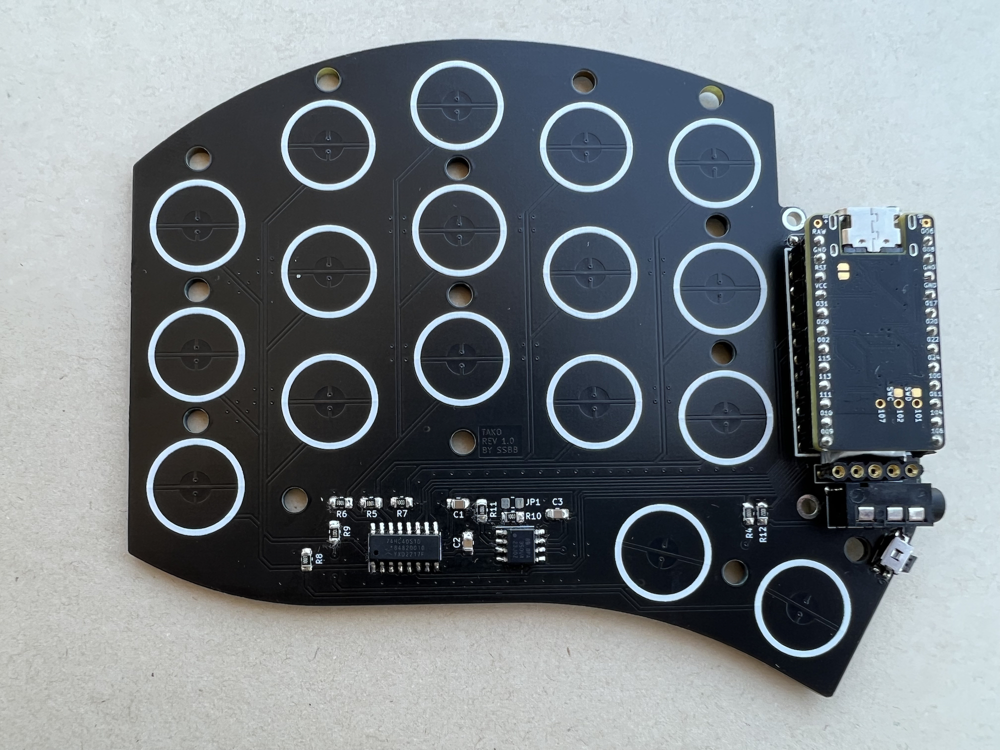
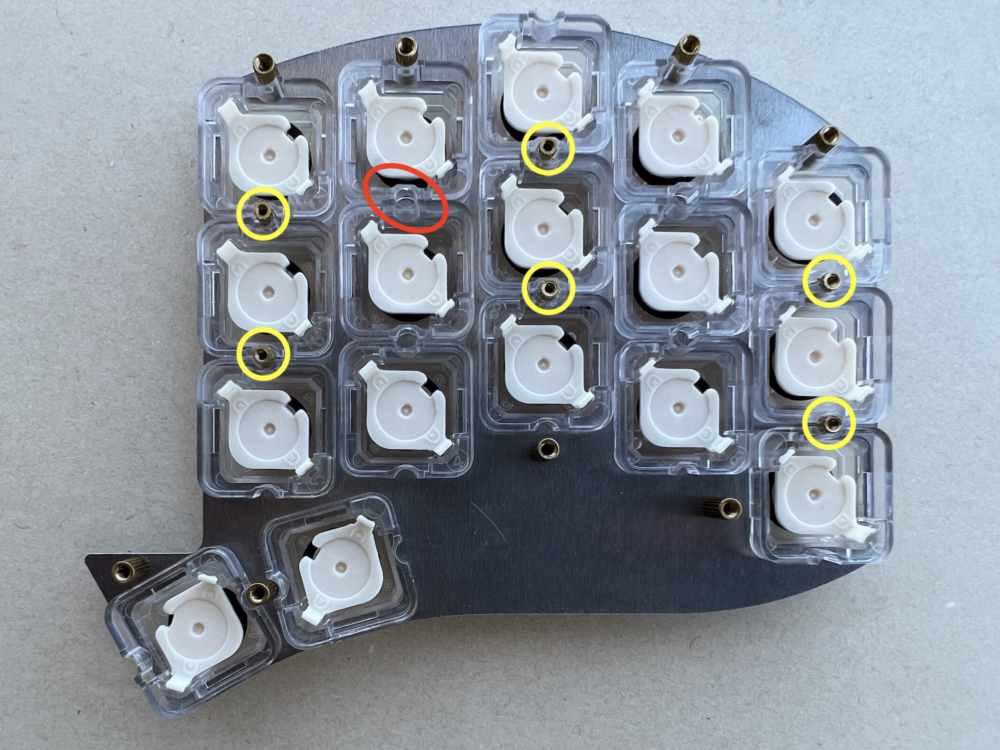
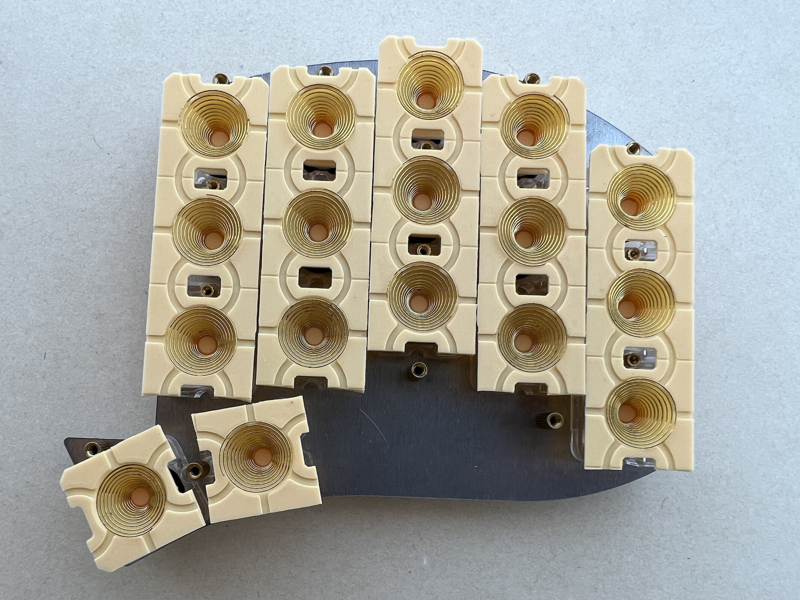

# Build Guide

## Preparation

The PCB is fabricated as a panel, so the first step is to gently break it in half."

## Solder components

Place all the components using the interactive BOM. You can solder them in any order; the only requirement is to solder the reset button before the TRRS jack.

Orientation only matters for the `OPA350` and `74HC4051` chips (`U2`, `U3`, `U102`, and `U103`). You should align the dot on the chip with the long line on the PCB. For the rest (resistors and capacitors), orientation does not matter.

Keep in mind that the left and right sides are not exact mirrors, so refer to the PCB and interactive BOM (iBOM) when soldering.

`JP1` and `JP101` are used to adjust OpAmp gain and can be ignored during the build.

`R12` and `R112` are used for keymap configuration in QMK, and you can ignore them for the wireless build.

If you have no experience in soldering SMD components, you can check out the [SMD Soldering Tutorial](https://www.youtube.com/watch?v=fYInlAmPnGo) video.

Solder the MCU and display sockets, battery, and power switch (for wireless) at this step as well. At the end, your assembly should resemble the following (note that you don't need to solder the TRRS jack for wireless):

## Test

Now, you can test the PCB before proceeding to ensure everything has been done correctly. Flash the firmware (the release contains default firmware for both QMK and ZMK) and open the console (it's enabled by default):

- QMK: https://github.com/qmk/qmk_firmware/blob/master/docs/faq_debug.md
- ZMK: https://zmk.dev/docs/development/usb-logging#viewing-logs

You should see a matrix scan with readings, and the values should change when you place your finger on the EC pads.

## Top plate

Now that you're sure everything works, it's time to prepare the top plate.

First of all, you should install the standoffs. If you're building an OEM plate, use M1.6 standoffs for the six yellow-marked positions, and the rest should be M2. For the NIZ plate, all standoffs should be M2. Then, proceed to install the housings. Refer to the red mark for the correct orientation. Finally, put sliders (with optional silencing rings installed) into the housings. You can lube slider rails prior of installing them.

Now, cut your domes so you have five 3x strips and two individual domes (or 10 and 4 for both sides). While holding top plate with one hand - place them to the housings with the other hand. Make sure all of them are aligned well and then put springs inside the domes.

## Final assembly

Now, cover the top plate with the assembled PCB, and then place the bottom plate on top of it. Secure everything with screws, remembering to use M1.6 screws for the six center standoffs when building the OEM plate.
