# TAKO BUILD GUIDE (ASSEMBLED) [WIP]

## PREPARATION


You'll receive a PCB as a panel, so the first thing you need to do is gently break it in the middle and clean the PCB edges with sandpaper.

## TRRS JACK AND OLED SOCKET

There are only a few components you need to solder - TRRS jack and optional OLED sockets. You can use masking tape to make this process easier.

At the end, you should have something like this:

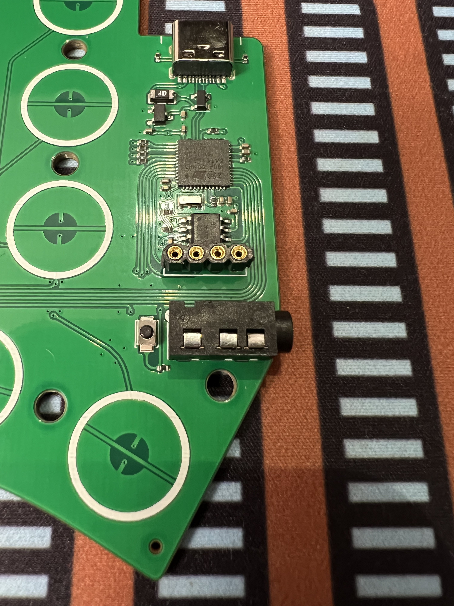

> **Warning**
> Please check the bottom plate. If you printed the first version of this, which had an issue with the TRRS cutout, then you either need to drill the missing holes or cut the TRRS legs in half before soldering, so the PCB lies flat.

## BOOTLOADER

We are going to flash the **tinyuf2** bootloader now because it's much easier to do when there is nothing else installed.

1. First, download the bootloader for **8Mhz** [here](https://github.com/ssbb/tinyuf2/actions/runs/5099838962).
2. Install [dfu-util](https://dfu-util.sourceforge.net/) if you haven't already.
3. Connect the PCB to USB while holding the small button next to the TRRS jack.
4. Confirm that you have entered bootloader mode with `dfu-util -l`. You should see something like this (note the `Found DFU` rows):

```
❯ dfu-util -l
dfu-util 0.11

Copyright 2005-2009 Weston Schmidt, Harald Welte and OpenMoko Inc.
Copyright 2010-2021 Tormod Volden and Stefan Schmidt
This program is Free Software and has ABSOLUTELY NO WARRANTY
Please report bugs to http://sourceforge.net/p/dfu-util/tickets/

Found DFU: [0483:df11] ver=2200, devnum=1, cfg=1, intf=0, path="0-1", alt=3, name="@Device Feature/0xFFFF0000/01*004 e", serial="307F345A3431"
Found DFU: [0483:df11] ver=2200, devnum=1, cfg=1, intf=0, path="0-1", alt=2, name="@OTP Memory /0x1FFF7800/01*512 e,01*016 e", serial="307F345A3431"
Found DFU: [0483:df11] ver=2200, devnum=1, cfg=1, intf=0, path="0-1", alt=1, name="@Option Bytes  /0x1FFFC000/01*016 e", serial="307F345A3431"
Found DFU: [0483:df11] ver=2200, devnum=1, cfg=1, intf=0, path="0-1", alt=0, name="@Internal Flash  /0x08000000/04*016Kg,01*064Kg,01*128Kg", serial="307F345A3431"
```

5. Flash the bootloader with `dfu-util -a 0 -i 0 -s 0x08000000:leave -D tinyuf2-ssbb_uf2_f401cbx_8mhz.bin`.
6. Repeat for the second half.

## STANDOFFS

Screw M2x6mm standoffs at the positions shown in the image below.

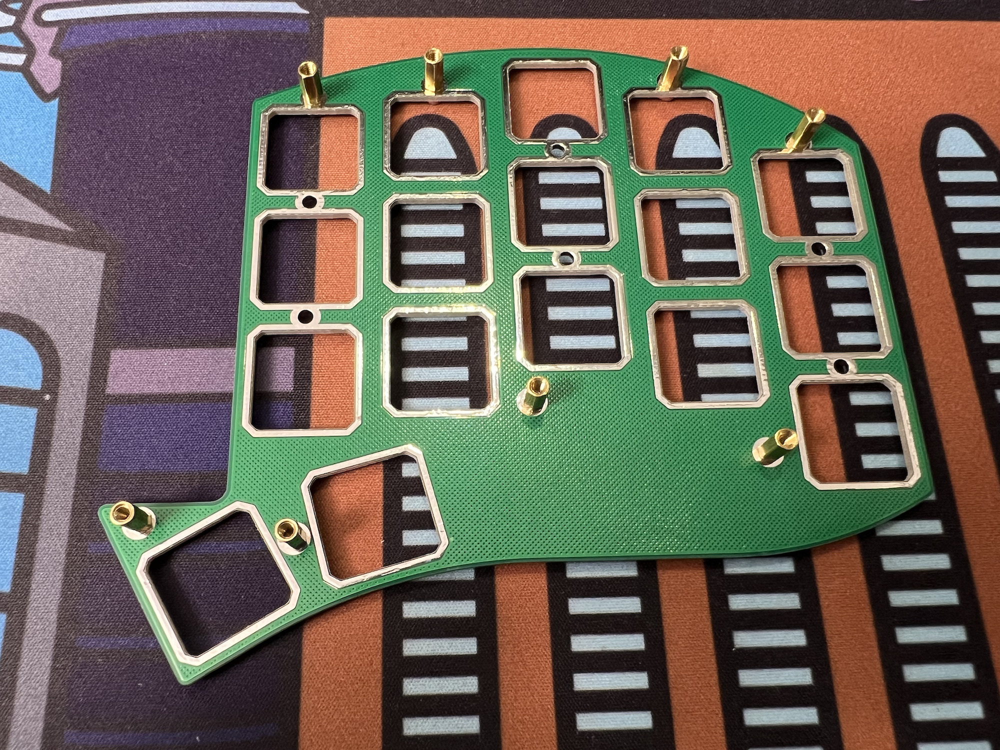

Unused mounting holes at the center won't work with M2 standoffs and should be used for optional mounting with something like M1.6 (maximum standoff OD is 2.5mm). Personally, I am not using them due to the low availability of M1.6, but they could be used to improve contact between the PCB and housings. More mounting points are always better for EC keyboards.

## HOUSINGS

Press the housings into the plate. They are not square, so you can only do it in one direction - confirm with the image below. They should "click" into place when properly fitted.

> **Warning**
> If you are installing housings for the second half, please double-check that the plate orientation is correct. You don't want to end up with two plates that can only be used for the left half.

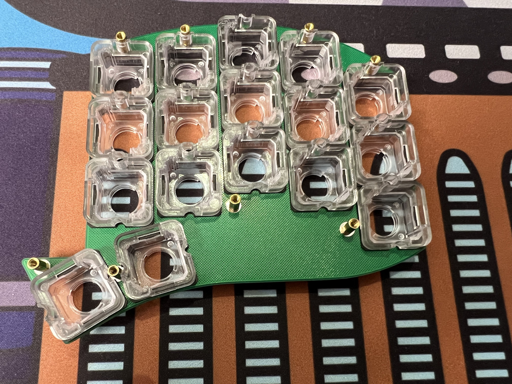

After you have installed all the housings, take a look at the back side. There is a good chance that some of the walls (marked in red) may be bent, as shown in the image above (where almost all of them are bent due to housing gasket usage). Just press on those walls with your thumb, and they should click and become straight (it may not be that simple with housing gaskets). It's important to do this so that the housings are not deformed and the sliders can move freely.

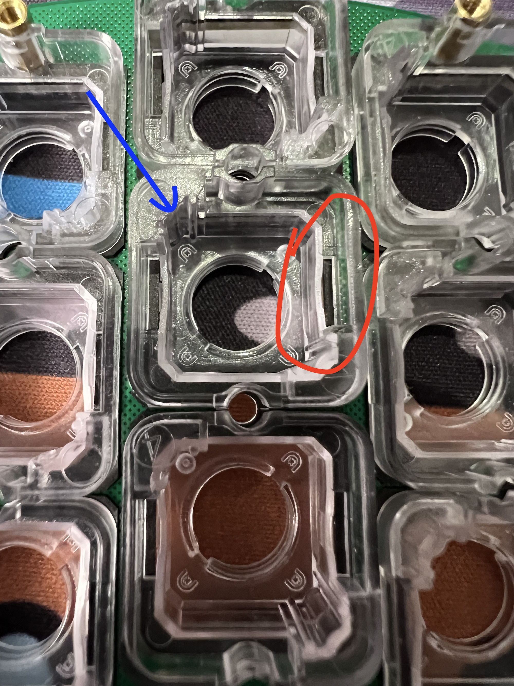

### LUBE (OPTIONAL)

You could lube the housing rails (where the blue arrow points in the image above) with something like 205g0. Some people prefer to lube them, while others do not - decide for yourself.

## SLIDERS

First, add a silencing ring to each slider:


Then, put them into the housings. Note the orientation of the slider rails and housing rails:

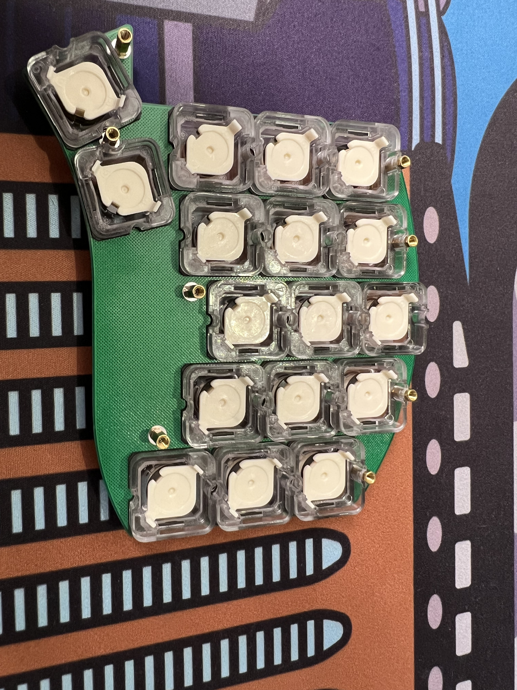

## DOMES

If you have domes in strips, you should cut them into sets of three. In total, you'll need 10 strips with 3 domes each and 4 single domes.

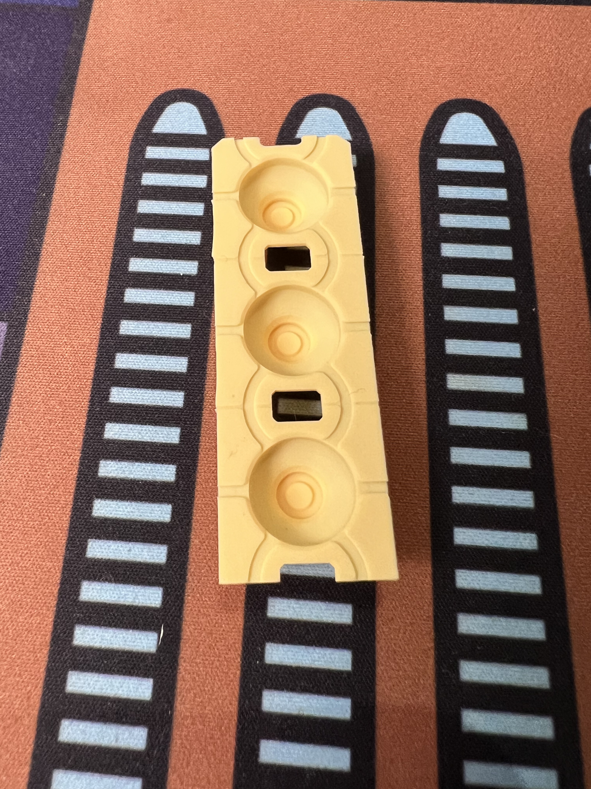

Then, place them over the housings so that you get something like this:

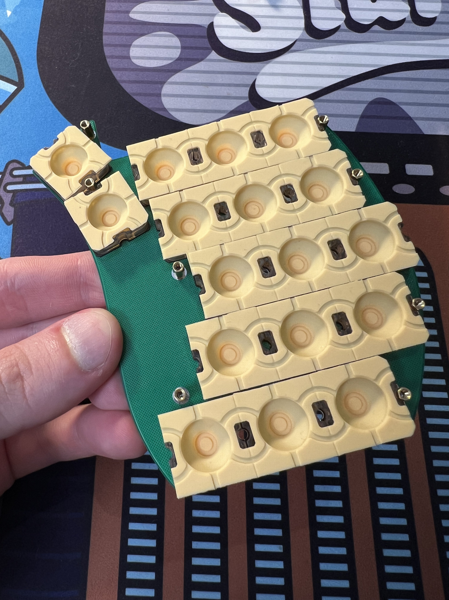

Make sure to align them properly so that there are no instances of one dome overlapping another, etc. Also, from this point on, you should keep the keyboard in your hand or use something as support to prevent the keys from being pressed.

## CONICAL SPRINGS

Now, add a spring into each dome and align it. It should be centered and stay within the dome. See the image below as a reference.

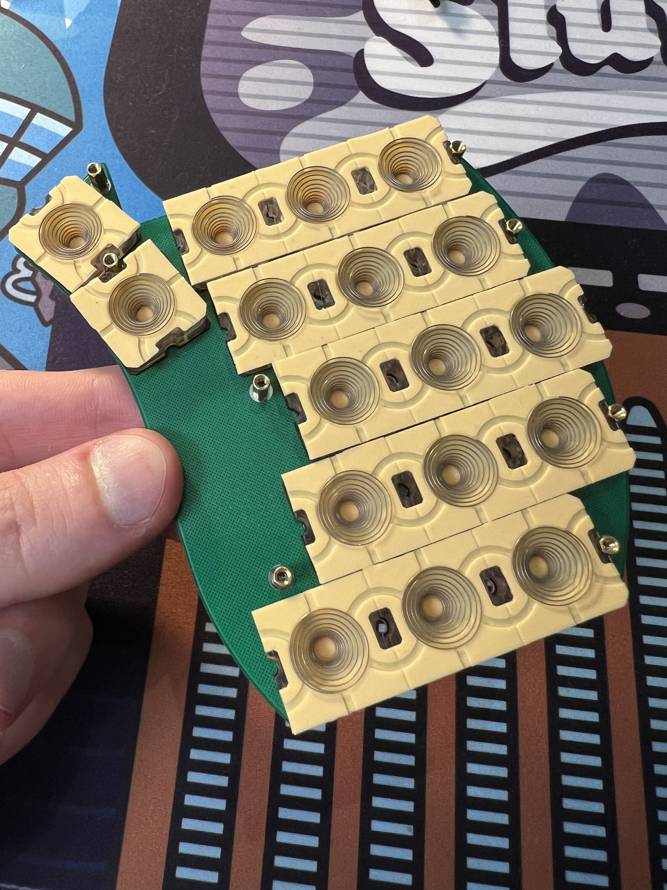

## PCB AND BOTTOM PLATE

Now, place the PCB over the domes and then the bottom plate over it (you can just stack the PCB and bottom plate and place them together).

Finally, screw the bottom plate to the standoffs. The standoffs are slightly shorter than the distance between the top and bottom plates (around 6.3mm vs 6mm). You don't need to screw them all the way to the end and bend the top plate, just make sure everything is fixed in place.

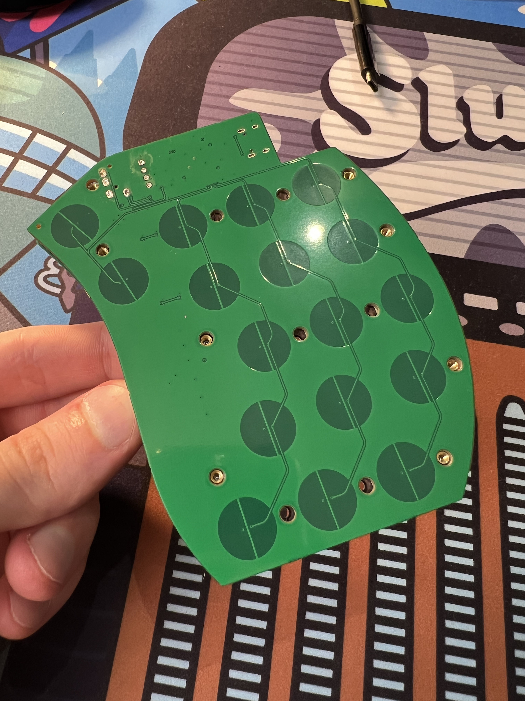

> **Note**
> There are no cutouts on the bottom plate in my photo because I forgot about them in the first prototype and just cut the socket legs instead.

Now, you can add some bumpons to the bottom plate:

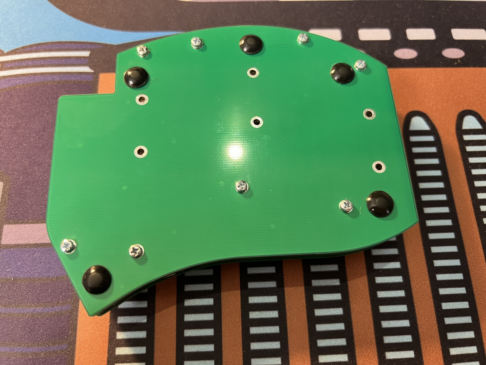

## RESULT

Now, you should have something like this. You did it, great job!

Repeat the same process for the second half.

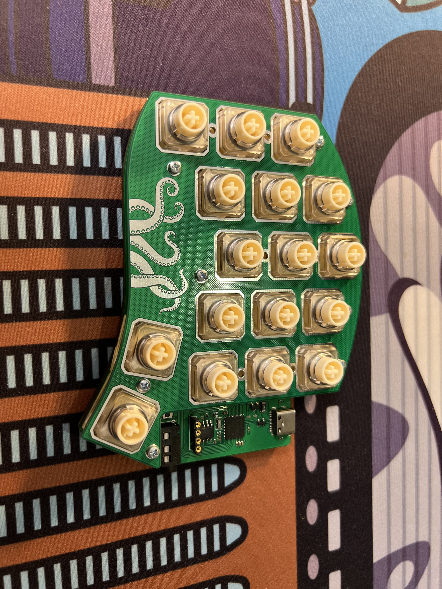
