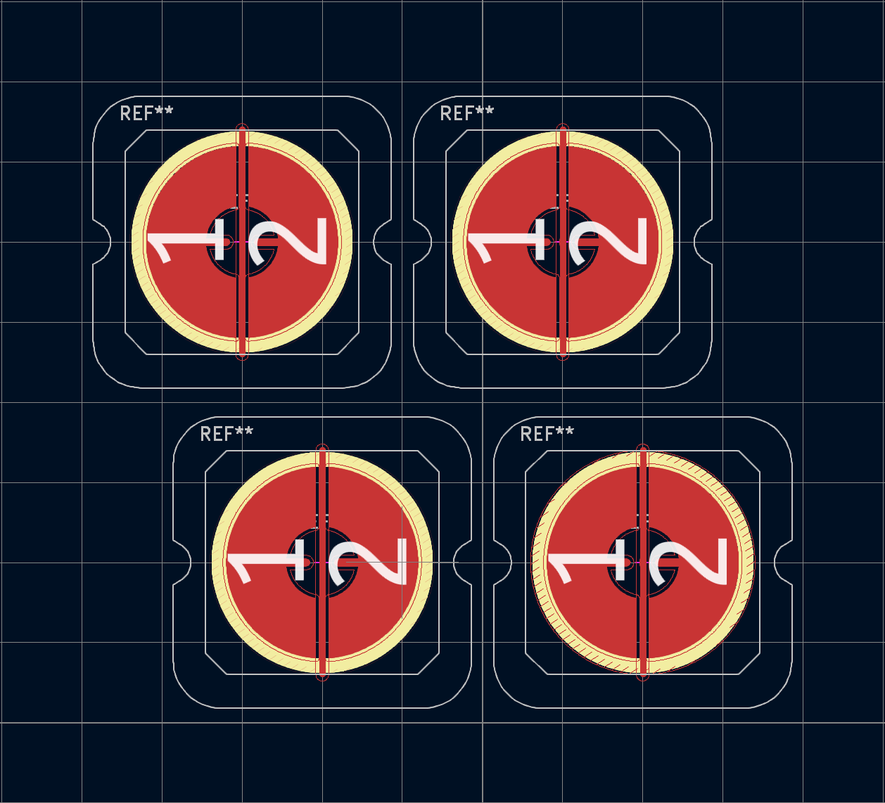
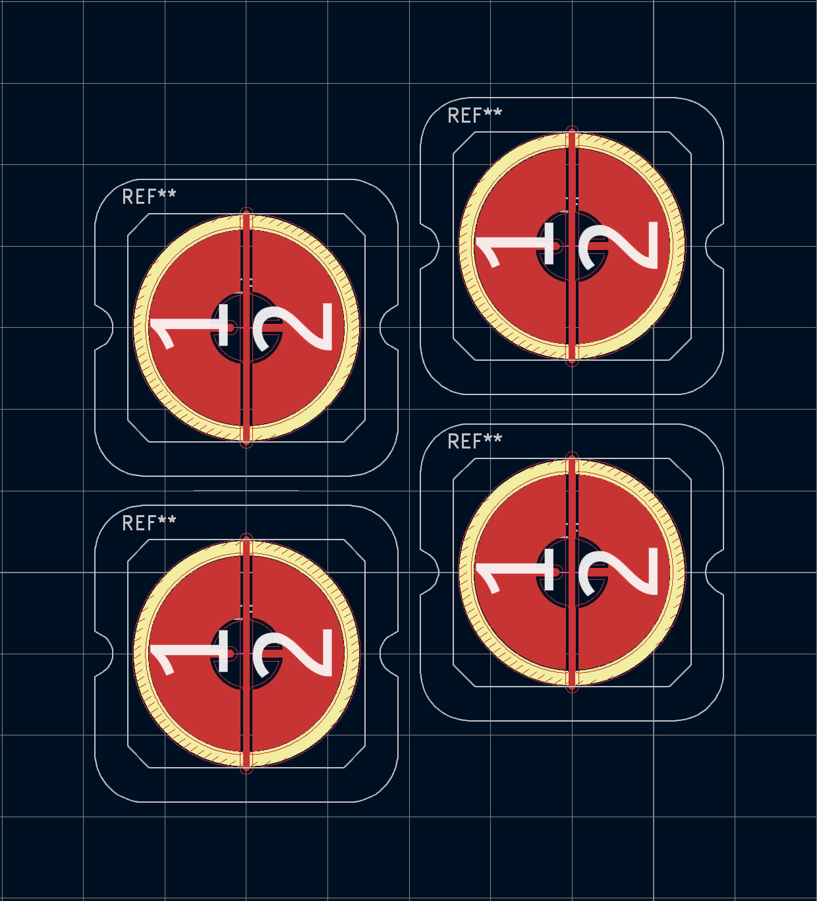
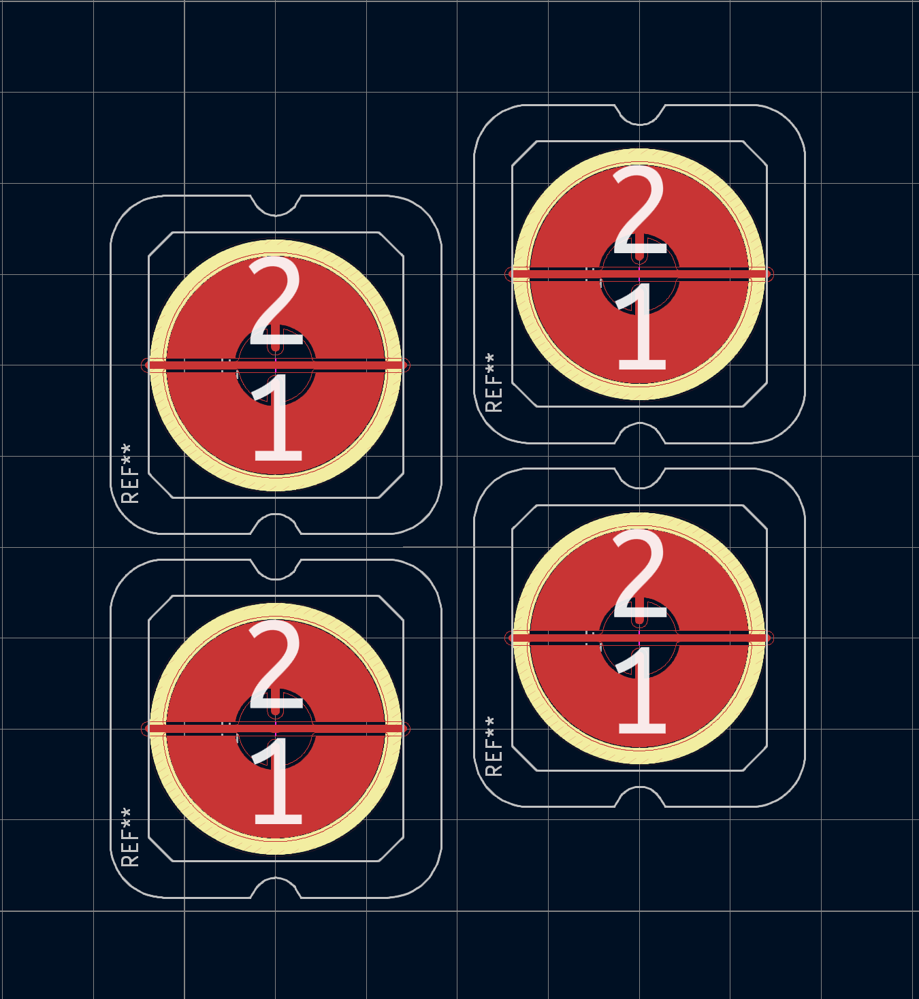

Topre housings are designed for row stagger:

You can put some screws between housings (see rounded cutouts at the sides) and dome strips designed to be used like this as well. But Tako is a column-staggered keyboard. And when we do the same we would get something like this:

Now, there is no space for screws, and you can't use dome strips due to the misaligned rows. So it's logical to change the housing orientation, making columns the new "arows".

And thats what I did in the default top plate. By fact we using housings like they designed to be used but for columns instead of rows. However, unlike in the MX world, Topre sliders only allow keycaps to be installed in one direction. So when using Topre sliders with rotated housings, your keycaps will end up at a 90-degree angle.

I don't think it's an issue at all since Topre-compatible keycaps are much rarer than MX ones. Therefore, it's unlikely that anyone making a 34-keyboard will need to use original Topre keycaps. However, if for some reason you want to do this, it's as easy as rotating the footprints in the top plate file and re-exporting it as Gerber. Feel free to contact me if you need any help.
