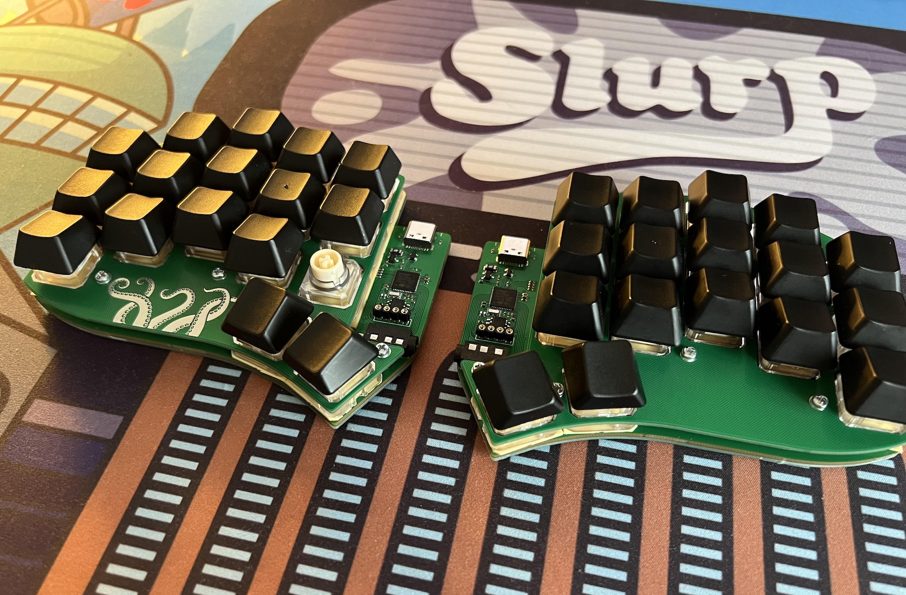

# Tako rev0

> **Warning**
> I warn against building this version since after working on new version for some time I realized that some things were done wrong so I strictly suggest to build rev1. I am not planning to support this so it can't be considered as PCBA alternative to rev1.

---

Tako is a vertical stagger split keyboard with electrostatic capacitive (EC) non-contact switches.

## Table of Contents

- [Features](#features)
- [Caveats](#caveats)
- [BOM](#bom)
- [Build guide](#build-guide)
- [Firmware](#firmware)

## Features

- Onboard USB-C with ESD protection
- STM32F4x1 MCU
- Actuation Point Changer
- USART Full-duplex
- [OLED](./docs/img/assembled_oled.jpg) support

## Caveats

- No tenting puck support since there is no space between housings for screw holes. But could be done on bottom plate with different case design.
- No reset button (the one you see on the photo is a STM32 Boot0)

## BOM

### Assembled version

| Part           | Amount | Details                                                                                                                                                                                         |
| -------------- | ------ | ----------------------------------------------------------------------------------------------------------------------------------------------------------------------------------------------- |
| Assembled PCB  | 1      | 1.6mm                                                                                                                                                                                           |
| Top plate      | 2      | 1.2mm thickness!                                                                                                                                                                                |
| Bottom plate   | 2      | 1.6mm                                                                                                                                                                                           |
| M2x6 standoffs | 16     | Max OD 3.3mm. [This](https://aliexpress.com/item/32975966103.html?sku_id=66665375911) and [this](https://aliexpress.com/item/1005003126118423.html?sku_id=12000024241636343) confirmed to work. |
| M2x4 screws    | 32     |                                                                                                                                                                                                 |
| PJ-320A        | 2      | Audio jack                                                                                                                                                                                      |
| TRRS Cable     | 1      |                                                                                                                                                                                                 |

> **Warning** **Top plate should be 1.2mm thick!**

#### Optional

| Part         | Amount |
| ------------ | ------ |
| 128x32 OLED  | 2      |
| OLED Sockets | 2      |

#### Optional mounting

There are also mounting holes between housings on 1, 3, and 5 columns. They are not required, and it should be fine not to use them. However, in case you experience some "squishing" sounds, especially on the homerow, it is likely that the housings are not sitting properly on the PCB. You should try to re-assemble keyboard first to ensure domes and springs aligned properly.

If this does not help, then you will need to add mounting somewhere at the center of the keyboard. There is no space for M2 standoffs between the housings, so you should use M1.6 (max OD is 2.5mm) or just a long M2 screw (around 11mm) with a nut on the bottom plate.

| Part             | Amount | Details                                                                                                                       |
| ---------------- | ------ | ----------------------------------------------------------------------------------------------------------------------------- |
| M1.6x6 standoffs | 12     | [Aliexpress](https://aliexpress.ru/item/4000582961951.html?spm=a2g2w.orderdetail.0.0.72ee4aa6N6dYoc&sku_id=10000003716437218) |
| M1.6x4 screws    | 24     |                                                                                                                               |

## Build guide

- [Build guide](./docs/buildguide_assembled.md)

## Firmware

Only QMK is supported.

- [Assembled version firmware](https://github.com/ssbb/qmk_firmware/tree/master/keyboards/ssbb/tako)
